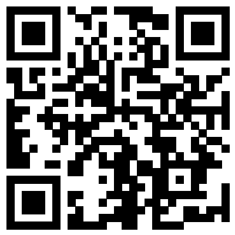

# Project-Directory
This is a brief summarization for some of the projects I've been working on!

## Personal Projects
### Gravitas: A 2D Tower Defense Indie Game  

### Shared Canvas: An In-person Collaboration App on iOS/iPadOS

### Faruzan Senpai: A Discord Bot for My Private Server 

### MC Marketplace: Prototype of a Game Item Marketplace on Ethereum

### iOS/iPadOS mini Apps

## Courseworks
### SVE-Optimized Matrix Multiplication

### Simulation of OS Components - CPU & I/O Task Scheduler, Memory & Disk, File System

### Java Painting GUI

