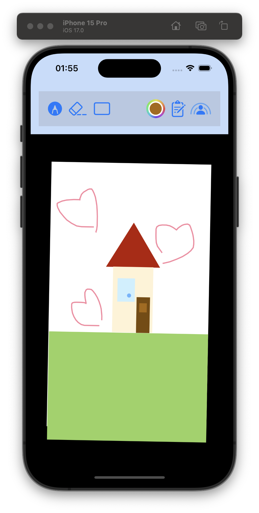
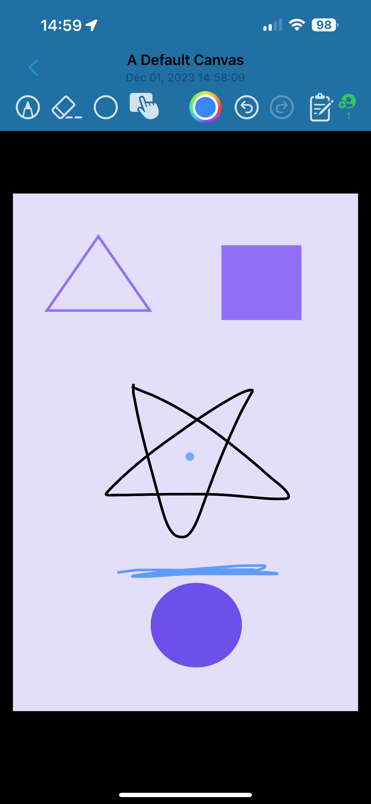

> This is a brief summarization for some of the projects I've been working on!

## Personal Projects

### [Gravitas: A 2D Tower Defense Indie Game](https://misakizzzzz.itch.io/gravitas) 
    

- Featured a **gravity-based battlefield**, where units have weights that influences the land's balance.
- Units and projectiles now affected by gravity, leading to a more fun and strategic tower defense game.
- Act as a saviour to save the world of magic, restoring the balance between light and darkness.
- Summon all heroes from the ancient past to fight against the wicked enemies.

<table style="border: 0; margin: auto;">
  <tr >
    <td style="border: 0; text-align: right; vertical-align: bottom; padding: 5px;"></td>
    <td style="border: 0; text-align: left; vertical-align: bottom; padding: 5px;"></td>
  </tr>
  <tr >
    <td style="border: 0; text-align: right; vertical-align: top; padding: 5px;"></td>
    <td style="border: 0; text-align: left; vertical-align: top; padding: 5px;"></td>
  </tr>
</table>

- (And...I also contributed to some Easter egg's art assets!)

    

  

### [Shared Canvas: An In-person Collaboration App on iOS/iPadOS](https://github.com/Samekichi/iOS-App-Projects)
    

- Focused on small groups of in-person meetings.
- User-friendly and responsive canvas view with scribble, eraser, and shape features.
- Share current canvas with nearby people, or join nearby sessions.
- Utilized **Multi-Peer Framework** for canvas hosting / data synchronization between endpoints.
- Leveraged `Codable` data structure to persist and transfer canvases using `JSON` or **Swift Data**.

  

    
    
Prototype

  

  

    
    
Running on a real device

  

### Faruzan Senpai: A Discord Bot for My Private Server 

### MC Marketplace: Prototype of a Game Item Marketplace on Ethereum

### iOS/iPadOS mini Apps

## Courseworks
### SVE-Optimized Matrix Multiplication

### Simulation of OS Components - CPU & I/O Task Scheduler, Memory & Disk, File System

### Java Painting GUI

