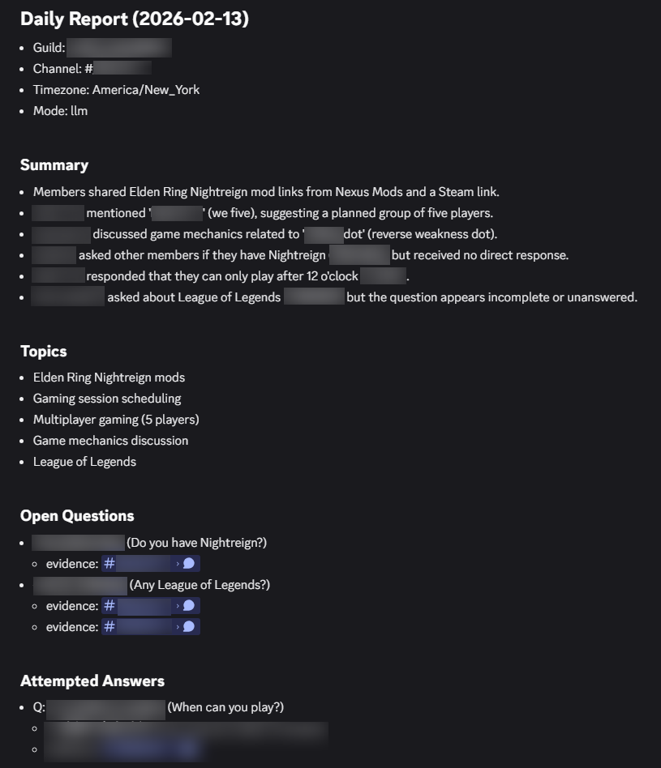
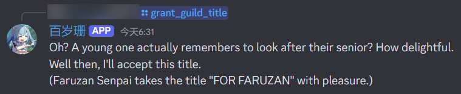
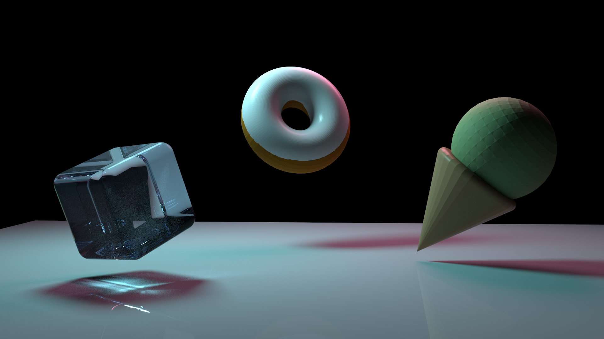
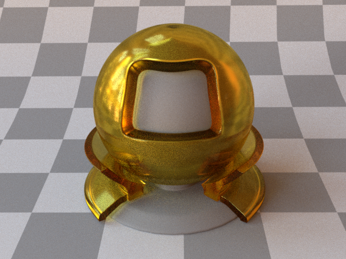
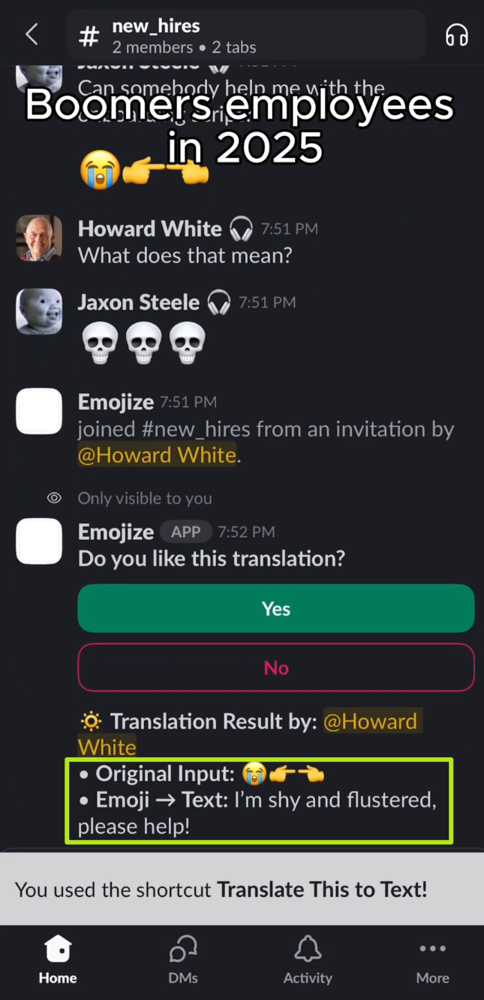
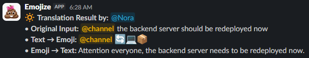
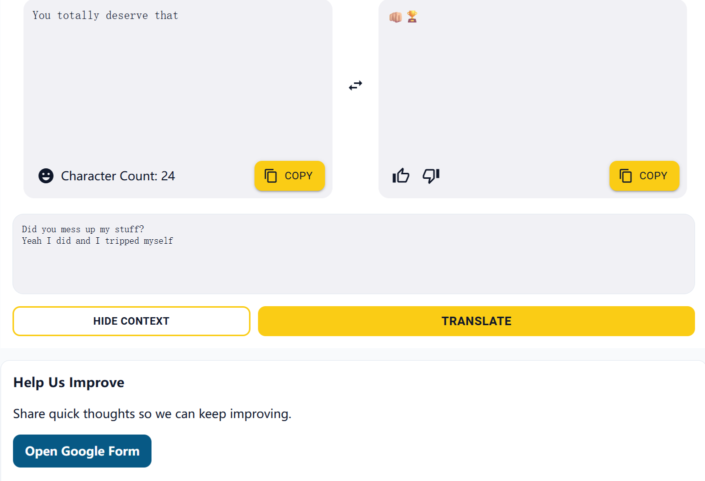

> This is a brief summarization for some of the projects I've been working on!

## Table of Contents
- [Table of Contents](#table-of-contents)
- [Personal Projects](#personal-projects)
  - [Gravitas: A 2D Tower Defense Indie Game](#gravitas-a-2d-tower-defense-indie-game)
  - [Shared Canvas: An In-person Collaboration App on iOS/iPadOS](#shared-canvas-an-in-person-collaboration-app-on-iosipados)
  - [Faruzan Senpai: A Discord Bot for My Private Server, integrating AI / LLM Features](#faruzan-senpai-a-discord-bot-for-my-private-server-integrating-ai--llm-features)
  - [MC Marketplace: Prototype of a Game Item Marketplace on Ethereum](#mc-marketplace-prototype-of-a-game-item-marketplace-on-ethereum)
  - [iOS/iPadOS mini Apps](#iosipados-mini-apps)
  - [Minecraft Mod Localizations](#minecraft-mod-localizations)
- [Courseworks](#courseworks)
  - [Disney BSDF for La Jolla Renderer](#disney-bsdf-for-la-jolla-renderer)
  - [LLM-powered Emoji-to-Text Translator on Slack \& Web](#llm-powered-emoji-to-text-translator-on-slack--web)
  - [SVE-Optimized Matrix Multiplication](#sve-optimized-matrix-multiplication)
  - [Java Painting GUI](#java-painting-gui)
  - [User-Book Read and Rating Prediction for Recommendar System](#user-book-read-and-rating-prediction-for-recommendar-system)
  - [Simulation of OS Components - CPU \& I/O Task Scheduler, Memory \& Disk, File System](#simulation-of-os-components---cpu--io-task-scheduler-memory--disk-file-system)

## Personal Projects

### [Gravitas: A 2D Tower Defense Indie Game](https://misakizzzzz.itch.io/gravitas) 
    

- An indie game for the VGDC game jam @ UCSD, in a great team of 2 programmers and 1 writer.
- Featured a **gravity-based battlefield**, where units have weights that influences the land's balance.
- Units and projectiles now affected by gravity, leading to a more fun and strategic tower defense experience.

  > Act as a saviour to save the world of magic, restoring the balance between light and darkness.
  > Summon all heroes from the ancient past to fight against the wicked enemies.

<table style="border: 0; margin: auto;">
  <tr >
    <td style="border: 0; text-align: right; vertical-align: bottom; padding: 5px;"></td>
    <td style="border: 0; text-align: left; vertical-align: bottom; padding: 5px;"></td>
  </tr>
  <tr >
    <td style="border: 0; text-align: right; vertical-align: top; padding: 5px;"></td>
    <td style="border: 0; text-align: left; vertical-align: top; padding: 5px;"></td>
  </tr>
</table>

- (And...I also contributed to some Easter egg's art assets!)

    

  

### Shared Canvas: An In-person Collaboration App on iOS/iPadOS
    

- Focused on small groups of in-person meetings.
- Consists of Canvas List view, Connection view, Canvas view, and various pop-ups for canvas settings, color picker, and scribble / eraser / shape tool customizations.
- Share current canvas with nearby people, or join nearby sessions.
- Utilized **Multi-Peer Framework** for canvas hosting / data synchronization between endpoints.
- Leveraged `Codable` data structure to persist and transfer canvases using `JSON` or **Swift Data**.

<b>Prototype</b> (Left)  and  <b>Running on a real device</b> (Right)

  

### Faruzan Senpai: A Discord Bot for My Private Server, integrating AI / LLM Features
       

- A **Discord Bot** for my private server need (multilingual support is planned), such as:
    - **Daily AI summary** for registered guild channels
    - **LLM chats**
    - User's daily luck
    - Game server time getter
    - Slash Command stats
    - Basic game Wiki inquiry
    - User Title system
    - ...
- Now on **AWS** with a local **PostgreSQL** database.
- Other features:
    - **Redis** cache layer
    - Enhanced User Title system
    - Spotify/NetEase Music integration (planned)

Scheduled daily AI summary for a text channel of my guild, with discord links to source messages

Some other command responses (title system)

  

### MC Marketplace: Prototype of a Game Item Marketplace on Ethereum
    
    

- Designed a smart contract which later deployed on Ethereum's Test Network.
- Implemented a simple front end for the marketplace with connection to MetaMask wallet and ABI's of the smart contract.
- Validated real-world blockchain connection and trades on Sepolia Test Network through Alchemy.

Marketplace with test items

Inventory with item status & Putting Item #9 off sale

  

### iOS/iPadOS mini Apps
  

- A set of iOS Apps that practices my skill. Mostly based on SwiftUI and MVVM principle, with some UIKit and MapKit hacks.

    1. **Spelling Challenge**
        - A **word-spelling game** for 3 languages (`en_US`, `fr_FR`, `de_DE`).
        - Support 5~7 candidate characters (with bonus and in different layouts), history, shuffle, hint, and restart.
        - Beautiful UI in both light & dark mode.
        

        
        
Solving a 7-char game in dark mode

        

          
    2. **Pentominoes**
        - A **puzzle game** in which player needs to form different patterns using all pentominoes.
        - Support reset and auto-solve.
        - Fluent and beautiful animations based on gesture and piece status.
        

        
        
Before and after solved (simulated on 11' and 12.9' iPad Pro)

        

          
    3. **Campus Map**
        - A **campus map** with data of all on-campus buildings.
        - Support favorites, search, filter, data persistence across launches, pins and pop-ups, and step-by-step routing between 2 buildings or from / to current location.
        

        
        
Map overview; Building detail and buttons; Route planning; and Step-by-step routing.

        

          
    4. **Pokédex**
        - A **Pokémon collection** with attribute inquiry, ancestor and successor, and “captured” labels.
        - Dynamically render transition color, index, and status in both List and Detail Views.
        

        
        
Home screen; Detail View; List of Fire Pokémons; "Our favorite!";  Ancestor and successor.

        

### Minecraft Mod Localizations
- Localized a bunch of Minecraft Fabric Mods.
- Report bugs & submit PR's while examining mod logics (for better translation and writing Wiki).
  

## Courseworks

### Disney BSDF for La Jolla Renderer
- Utilized C++ `std::variant` pattern to implement Disney BSDF materials in *[La Jolla](https://github.com/BachiLi/lajolla_public)* renderer:
  1. Diffuse with subsurface
  2. Metal
  3. Clearcoat
  4. Glass
  5. Sheen
- Converted a self-made Blender scene to La Jolla and rendered correctly.

    
  

  
  
A rendered self-made Blender scene using DisneyBSDF. 

  

  

  
  
Volumetric version of the scene above.  Foggy air, a blue volumetric interior of the ice cube, and a softer ice cream ball.

  

  

  
  
A rendered sample using DisneyGlass material

  

### LLM-powered Emoji-to-Text Translator on Slack & Web
     

- With my great team members, developed a full-stack translation platform using FastAPI and React, accelerated development lifecycle by ~40% through AI-assisted planning and auto test suite integration.
- Engineered a high-concurrency **"Model Racing" architecture** using Python Asyncio to **parallelize requests across LLMs, reducing P99 latency by >300ms to meet 1-second RAIL performance standards.**
- Designed a lightweight RAG (Retrieval-Augmented Generation) system using sentence-transformers and local vector search, improving per-user accuracy by adding user’s feedback as context to LLM prompt. 
- Built modular RESTful APIs for translation and feedback. Ensured scalability and deployability via Docker.
    
  

  
  
    
  
  
Slack App & Web App showcases

  

### SVE-Optimized Matrix Multiplication
- Implemented and modified BLISlab GEMM blocking algorithm in C.
- Improve row-major matrix multiplication efficiency, reducing cache misses on AWS EC2 Ubuntu machines by more than 33%.
- Accelerated microkernel by 4x with ARM SVE, loop unrolling, and pointer techniques (comparing to naïve).

### Java Painting GUI
- A Painter GUI implemented using Java with `SpringLayout`.
- Support 1st / 2nd colors, different shapes and lines, and options including stroke parameter, filled, gradients, and dashed.
    
  

  
  
My masterpiece of a beautiful scenary!

  

### User-Book Read and Rating Prediction for Recommendar System
- Predict *whether a user reads a book* in various approaches and compared their performance, including:
  - Logistic Regression
  - Bayesian Personalized Ranking (Implicit)
  - *Trivial thresholds based on Popularity & Jaccard / CosineSet Similarities
- Predict *a user's rating on a given book*:
  - *BiasOnly Latent Factor Model (Surprise, Tenserflow, & PyTorch)
  - Latent Factor Model w/ Dimensionality Reduction (Tensorflow)

### Simulation of OS Components - CPU & I/O Task Scheduler, Memory & Disk, File System
- Used C to emulate the following components:
  - multi-threaded CPU/IO task schedulers,
  - disk and virtual memory access with support of TLB and second-level page table, and
  - a file system with symbolic links and security constraints.

